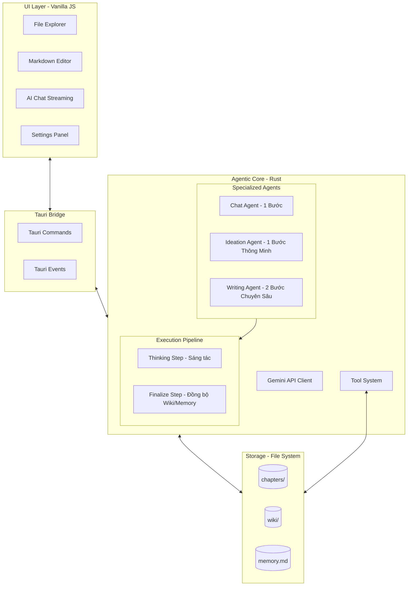

# AI_Write_Novel Architecture 🏗️

Hệ thống **AI_Write_Novel** được thiết kế theo kiến trúc lớp (Layered Architecture) kết hợp với mô hình hướng sự kiện (Event-Driven). Trái tim của hệ thống là một **Multi-Agent Orchestrator** giúp điều phối các tác vụ thông qua các luồng xử lý tinh gọn và tối ưu hóa tối đa về hiệu năng.

---

## 1. Tổng quan các Lớp



### 1.1 Frontend (UI Layer)
- **Thành phần**: 
    - **File Explorer**: Quản lý cây thư mục truyện, tích hợp sâu với `wiki/`.
    - **Markdown Editor**: Trình soạn thảo chính.
    - **AI Chat**: Hỗ trợ hiển thị "Thought Blocks" phân loại theo từng bước xử lý thời gian thực.
- **Phản ứng sự kiện**: 
    - Lắng nghe `ai-chat-stream-thought` để hiển thị tiến trình tư duy trung gian (`thinking`, `finalize`).
    - Lắng nghe `ai-agent-selected` để hiển thị Agent đang hoạt động.
    - Lắng nghe `ai-chat-stream` để nhận dữ liệu text stream từ Gemini.

### 1.2 Bridge (Tauri Layer)
- **Commands**: `ai_chat`, `stop_ai_chat`, `get_settings`, `open_file`, v.v.
- **Global Events**: Stream dữ liệu real-time qua Webview Window.

### 1.3 Agentic Backend (Rust Layer)
Hệ thống sử dụng cơ chế **Multi-Agent Coordination** tinh gọn và hiệu quả với tốc độ phản hồi nhanh hơn **2.5x đến 5x** nhờ cơ chế đặc biệt:

#### ⚡ Cơ chế Tự động Nạp Bối cảnh (Auto-Context Injection)
Loại bỏ hoàn toàn bước Phân tích (`analyze`) trung gian làm tiêu tốn một lượt gọi API và làm chậm trải nghiệm. Ngay khi bắt đầu xử lý, hệ thống Rust sẽ tự động thu thập:
- Cấu trúc thư mục hiện có (danh sách các chương trong `chapters/`).
- Danh sách các thực thể Wiki đã tạo (nhân vật, địa danh, lore, plot trong `wiki/`).
- Bản tóm tắt dự án mới nhất trong `memory.md`.

Toàn bộ thông tin này được backend Rust nạp trực tiếp vào **System Instruction** của AI dưới dạng bối cảnh chuẩn. AI luôn có cái nhìn toàn vẹn và nhất quán về tác phẩm ngay từ lượt gọi đầu tiên.

#### 🛠️ 3 Luồng Xử lý Tinh gọn Chuyên biệt
1. **Chat Mode (Trò chuyện & Tra cứu - 1 bước)**:
   - Chạy 1 bước (`complete` phase). AI trả lời người dùng và có khả năng sử dụng các công cụ Google Search hoặc đọc lại chương truyện cũ nếu được hỏi.
2. **Ide Mode (Lên ý tưởng & Xây dựng Thế giới - 1 bước thông minh)**:
   - Chạy 1 bước (`complete` phase / hiển thị `"thinking"` trên UI). 
   - AI brainstorm ý tưởng, tìm kiếm tư liệu qua Google Search, và **chủ động gọi công cụ `wiki_upsert_entity` để tạo mới/cập nhật Wiki** (nhân vật, địa danh, lore) khi cả hai thống nhất ý tưởng mới. AI cũng tự động cập nhật ý tưởng cốt lõi vào `memory.md` qua tool call.
3. **Writing Mode (Sáng tác & Đồng bộ - 2 bước chuyên sâu)**:
   - **Bước 1: Sáng tác (Writing - phase: `"thinking"`)**: AI tập trung sáng tác chương mới chất lượng cao dựa trên bối cảnh nạp sẵn. Phản hồi JSON chứa bản thảo chương truyện được hệ thống tự động lưu vào file chương truyện `.md` trực tiếp bằng Rust.
   - **Bước 2: Đồng bộ & Hoàn thiện (Sync & Finalize - phase: `"finalize"`)**: AI nhận nội dung chương mới viết, rà soát trích xuất thực thể, gọi `wiki_upsert_entity` để cập nhật Wiki, và viết bản tóm tắt tiến trình mới nhất cập nhật vào `memory.md`.

---

## 2. Hệ thống Wiki & Memory

### 2.1 Wiki Graph
- **Vị trí**: Thư mục `wiki/`.
- **Phân loại**:
  - `wiki/Characters/` : Thông tin chi tiết các nhân vật.
  - `wiki/World/` : Địa danh, quốc gia, bối cảnh.
  - `wiki/Lore/` : Lịch sử, hệ thống sức mạnh, vật phẩm.
  - `wiki/Plot/` : Timeline, các sự kiện quan trọng.
- **Cơ chế**: Dữ liệu thực thể được lưu trữ dưới dạng Markdown kèm YAML Frontmatter chứa `type`, `tags`, và `relations` (liên kết thực thể). AI chủ động cập nhật qua bước `finalize` (đối với Writing) hoặc trực tiếp qua tool calling (đối với Ide).

### 2.2 Memory & Context Optimization
- **`memory.md`**: Lưu trữ bản tóm tắt trạng thái cốt truyện hiện tại và sơ đồ kết nối Wiki Tree.
- **Context Pruning**: Hệ thống tự động dọn dẹp các nội dung Tool Response cũ hoặc quá dài trong lịch sử hội thoại trước các bước cuối để tiết kiệm tối đa Token mà không làm mất ngữ cảnh cốt lõi.

---

## 3. Luồng xử lý Tổng quát mới

```
[Người dùng gửi Yêu cầu]
         │
         ▼
[Backend xác định Agent]
         │
 ┌───────┼────────────────────────┐
 ▼ (Chat)▼ (Ide)                  ▼ (Writing)
[Chat]  [Brainstorm]             [Bước 1: Sáng tác (thinking)]
 │       │                        - Viết chương & tự lưu file bằng Rust
 │       │                                │
 │       │                                ▼
 │       │                       [Bước 2: Đồng bộ & Hoàn thiện (finalize)]
 │       │                        - Gọi tool cập nhật wiki/
 │       │                        - Lưu tóm tắt tiến độ vào memory.md
 └───────┼────────────────────────┘
         │
         ▼
[Báo cáo kết quả cho Người dùng]
```

---

## 4. JSON Pipeline & Automation 🤖

Hệ thống áp dụng **JSON-Strict Flow** tại các bước then chốt:
- Agent tại bước `Thinking` (Writing) và bước `Finalize` (Writing) được yêu cầu trả về JSON block chứa định dạng nghiêm ngặt.
- Backend Rust sử dụng `extract_json_block` để trích xuất dữ liệu an toàn.
- **Tự động hóa**: Nếu Agent trả về `chapter_content`, hệ thống tự động gọi ghi file truyện. Nếu Agent trả về `project_summary`, hệ thống tự động ghi cập nhật `memory.md`, giúp quy trình hoạt động cực kỳ ổn định và tin cậy.

---

## 5. Cơ chế Thought Streaming

Mọi bước tư duy trung gian đều được stream về Frontend qua sự kiện `ai-chat-stream-thought`, cho phép người dùng quan sát quá trình Agent:
- Đang phác thảo ý tưởng brainstorm.
- Đang viết chương truyện chi tiết.
- Đang rà soát và cập nhật thực thể Wiki hay ghi nhận bộ nhớ dự án.

---

## 6. Quy tắc Mở rộng

- **Thêm Tool**: Định nghĩa trong `ai/tools.rs` và đăng ký trong `execute_tool_calls` tại `ai/nodes/mod.rs`.
- **Thêm/Chỉnh sửa Node**:
  - Viết logic xử lý trong file node tương ứng thuộc thư mục `ai/nodes/`.
  - Kết nối node trong hàm `ai_chat` của `ai/chat.rs`.
