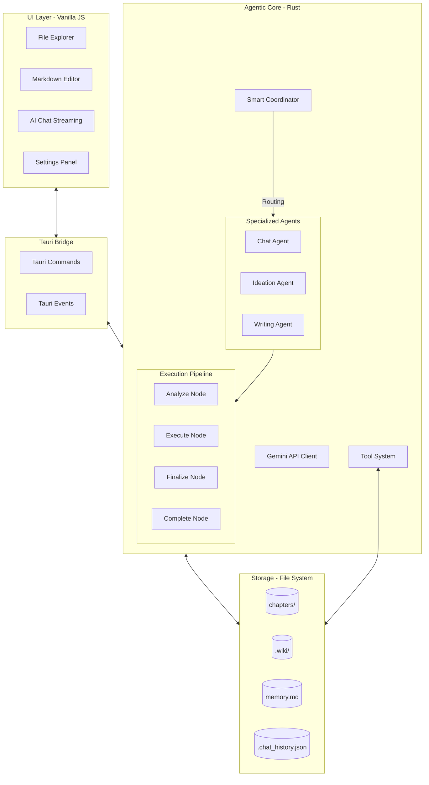

# AI_Write_Novel Architecture 🏗️

Hệ thống **AI_Write_Novel** được thiết kế theo kiến trúc lớp (Layered Architecture) kết hợp với mô hình hướng sự kiện (Event-Driven). Trái tim của hệ thống là một **Multi-Agent Orchestrator** giúp điều phối các tác vụ phức tạp một cách thông minh.

## 1. Tổng quan các Lớp

### 1.1 Frontend (UI Layer)
- **Thành phần**: 
    - **File Explorer**: Quản lý cây thư mục, tích hợp sâu với `.wiki/`.
    - **Markdown Editor**: Trình soạn thảo chính.
    - **AI Chat**: Hỗ trợ hiển thị "Thought Blocks" (quá trình tư duy) và kết quả cuối cùng.
- **Phản ứng sự kiện**: 
    - Lắng nghe `ai-chat-stream-thought` để hiển thị các bước xử lý trung gian.
    - Lắng nghe `ai-agent-selected` để cập nhật trạng thái Agent đang hoạt động trên UI.

### 1.2 Bridge (Tauri Layer)
- **Commands**: `ai_chat`, `stop_ai_chat`, `get_settings`, v.v.
- **Global Events**: Stream dữ liệu real-time và thông báo trạng thái Agent.

### 1.3 Agentic Backend (Rust Layer)
Hệ thống sử dụng cơ chế **Multi-Agent Coordination**:
- **Smart Coordinator**: Phân tích tin nhắn đầu vào bằng model có độ trễ thấp để quyết định Agent chuyên trách hoặc trả lời trực tiếp.
- **Specialized Agents**: 
    - `Writing`: Chuyên viết và sửa đổi văn bản.
    - `Ideation`: Chuyên lên ý tưởng và phát triển cốt truyện.
    - `Chat`: Chuyên giải đáp thắc mắc và tìm kiếm thông tin.
- **Execution Pipeline**:
    - **Analyze**: Phân tích sâu yêu cầu, đọc context và lập kế hoạch thực thi.
    - **Execute**: Gọi các công cụ (Tools) như `write_file`, `wiki_upsert_entity`, Google Search.
    - **Finalize**: Kiểm tra lại kết quả, đảm bảo tính nhất quán (Consistency).
    - **Complete**: Tổng hợp và stream kết quả cuối cùng tới người dùng.

---

## 2. Hệ thống Wiki & Memory

### 2.1 Wiki Graph
- **Vị trí**: Thư mục `.wiki/`.
- **Cơ chế**: Agent chủ động đọc và cập nhật các thực thể (Nhân vật, Địa danh, Sự kiện) để đảm bảo không bị "quên" chi tiết trong quá trình sáng tác dài.

### 2.2 Memory & Context Optimization
- **`memory.md`**: Lưu trữ tóm tắt cốt truyện và các lưu ý quan trọng.
- **Context Pruning**: Hệ thống tự động dọn dẹp các kết quả Tool cũ hoặc lịch sử quá dài để tối ưu hóa Token mà vẫn giữ được Context cần thiết cho Pipeline.

---

## 3. Luồng xử lý Tổng quát

1.  **Intent Classification**: `Coordinator` quyết định Agent phù hợp.
2.  **Specialization**: Hệ thống tải System Instruction chuyên biệt cho Agent đó.
3.  **Reasoning Loop**: 
    - AI gửi "Thoughts" về UI để thông báo tiến độ.
    - Thực hiện chuỗi Node: `Analyze` -> `Execute` -> `Finalize`.
4.  **Final Response**: `Complete` node gửi câu trả lời hoàn chỉnh và kết thúc phiên làm việc của Agent.

---

## 4. Cơ chế Thought Streaming
Hệ thống AI_Write_Novel không coi AI là một "black box". Mọi bước tư duy trung gian đều được stream về Frontend thông qua:
- **Event**: `ai-chat-stream-thought`
- **Data**: Chứa `phase` (Analyze/Execute/...) và nội dung `text` mô tả hành động đang thực hiện.

---

## 5. Quy tắc Mở rộng

- **Thêm Tool**: Định nghĩa trong `ai/tools.rs` và đăng ký trong `execute_tool_calls` tại `ai/nodes/mod.rs`.
- **Thêm Agent**: Định nghĩa `AgentType` mới và bổ sung Instruction chuyên biệt trong `ai/instructions.rs`.

