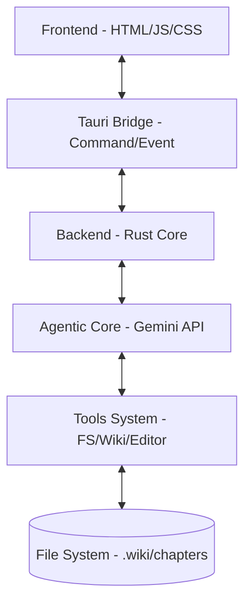

# AI_Write_Novel Architecture 🏗️

Hệ thống **AI_Write_Novel** được thiết kế theo kiến trúc lớp (Layered Architecture) nhằm tách biệt giữa giao diện người dùng (Frontend) và logic xử lý thông minh (Agentic Backend).

## 1. Tổng quan các Lớp

### 1.1 Frontend (UI Layer)
- **Công nghệ**: Vanilla JS, CSS, HTML.
- **Vai trò**: Hiển thị giao diện người dùng, trình soạn thảo (Editor), và khung chat AI.
- **Tương tác**: Sử dụng `@tauri-apps/api/core` để gọi lệnh (invoke) và nghe sự kiện (listen) từ Backend.

### 1.2 Tauri Bridge
- **Commands**: Các hàm Rust được đánh dấu `#[tauri::command]` cho phép UI gọi thực thi.
- **Events**: Cơ chế đẩy dữ liệu thời gian thực từ Rust sang UI (ví dụ: cập nhật cây thư mục, stream nội dung chat).

### 1.3 Agentic Backend (Rust Layer)
- **Core AI**: Quản lý vòng lặp Agent (Agent Loop) và giao tiếp với Google Gemini API.
- **Decision Making**: Sử dụng tính năng **Function Calling** (Công cụ) để cho phép AI tự ra quyết định thao tác hệ thống.
- **FS Manager**: Quản lý các file truyện (`chapters/`) và dữ liệu kiến thức (`.wiki/`) trực tiếp trên đĩa cứng.

---

## 2. Hệ thống Wiki Graph (Knowledge System)

Dự án sử dụng mô hình "Wiki Graph" dạng tệp tin để lưu trữ kiến thức về câu chuyện:

- **Vị trí**: Thư mục `.wiki/` ở gốc dự án.
- **Cấu trúc**: Phân loại theo thư mục:
  - `Characters/`: Hồ sơ nhân vật (.md).
  - `Lore/`: Kiến thức về thế giới, quy tắc phép thuật (.md).
  - `Plot/`: Các mốc cốt truyện, timeline (.md).
  - `World/`: Địa danh, bản đồ, bối cảnh (.md).
- **Metadata**: Sử dụng **YAML Frontmatter** để lưu trữ tag và loại thực thể, giúp Agent dễ dàng lọc và tìm kiếm.

---

## 3. Luồng làm việc của Agent (Agentic Workflow)

1. **User Prompt**: Người dùng gửi yêu cầu viết hoặc chỉnh sửa.
2. **Context Gathering**: Agent sử dụng công cụ `wiki_list_entities` và `read_file` để thu thập kiến thức liên quan từ `.wiki/`.
3. **Reasoning**: Agent suy luận và quyết định hành động (gọi công cụ).
4. **Action**: Thực thi ghi file (`write_file`), cập nhật wiki (`wiki_upsert_entity`), hoặc mở file (`open_file`).
5. **UI Sync**: Backend phát sự kiện `file-system-changed` để UI tự động cập nhật trạng thái mới nhất.

---

## 4. Quy tắc Mở rộng

- **Thêm tính năng**: Viết hàm Rust -> Đăng ký Tauri Command -> Mapping vào Gemini Tool.
- **Cập nhật UI**: Luôn lắng nghe Events từ Backend để đảm bảo trạng thái dữ liệu đồng nhất.
