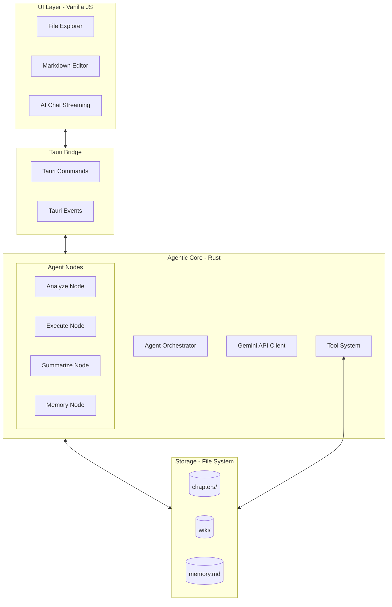

# AI_Write_Novel Architecture 🏗️

Hệ thống **AI_Write_Novel** được thiết kế theo kiến trúc lớp (Layered Architecture) kết hợp với mô hình hướng sự kiện (Event-Driven), giúp tách biệt logic xử lý AI nặng nề ở Backend và phản hồi mượt mà ở Frontend.

## 1. Tổng quan các Lớp

### 1.1 Frontend (UI Layer)
- **Công nghệ**: HTML5, Vanilla JS, CSS3.
- **Phản ứng sự kiện**: 
    - Lắng nghe `file-system-changed` để làm mới cây thư mục.
    - Lắng nghe `open-file` để tự động chuyển tab Editor sang file mới được tạo/sửa.
    - Stream dữ liệu từ `ai-chat-stream` để hiển thị nội dung và Thought blocks.

### 1.2 Bridge (Tauri Layer)
- **Commands**: `ai_chat`, `check_api_key`, `save_api_key`, `get_chat_history`.
- **Global Events**: Sử dụng `app_handle.emit()` để đồng bộ trạng thái từ Rust sang JS mà không cần yêu cầu từ Frontend.

### 1.3 Agentic Backend (Rust Layer)
Thay vì một yêu cầu AI đơn lẻ, hệ thống sử dụng **Agent Loop** với các Node chuyên biệt:
- **Analyze Node**: Chia nhỏ yêu cầu của người dùng thành các bước thực thi cụ thể.
- **Execute Node**: Gọi các Function Calling (Tools) như `write_file`, `wiki_upsert_entity`.
- **Summarize Node**: Tổng hợp kết quả và thông báo cho người dùng.
- **Memory Node**: Cập nhật trạng thái vào `memory.md`.

---

## 2. Hệ thống Wiki & Memory

### 2.1 Wiki Graph
- **Vị trí**: Thư mục `wiki/`.
- **Cấu trúc**: Phân loại theo `Characters/`, `Lore/`, `Plot/`, `World/`.
- **Đồng bộ**: Khi AI tạo thực thể mới, nó tự động chèn YAML Frontmatter để UI có thể hiển thị metadata (tags, type).

### 2.2 Long-term Memory
- **Tệp `memory.md`**: Lưu trữ tóm tắt các sự kiện đã xảy ra, các quyết định quan trọng của tác giả và tiến độ của câu chuyện. 
- **Vai trò**: Giúp Agent giữ được tính nhất quán trong các phiên làm việc dài hoặc khi chuyển đổi giữa các chương.

---

## 3. Luồng xử lý Tống quát

1. **User Input**: Người dùng gửi yêu cầu (ví dụ: "Viết tiếp chương 2").
2. **Context Loading**: Agent đọc `memory.md` và các file liên quan trong `wiki/`.
3. **Execution Loop**:
    - `Analyze`: Quyết định cần viết vào file nào, dùng kiến thức nào.
    - `Action`: Gọi `write_file`. Backend phát sự kiện `open-file`.
4. **UI Update**: Editor tự động mở chương 2, File Explorer cập nhật biểu tượng file mới.
5. **Finalize**: Agent tóm tắt công việc đã làm và lưu vào bộ nhớ.

---

## 4. Quy tắc Mở rộng

- **Thêm Tool**: Định nghĩa trong `ai/tools.rs` -> Khai báo JSON cho Gemini -> Bổ sung logic xử lý trong `execute_tool_calls` tại `ai/nodes/mod.rs`.
- **Thêm Node**: Tạo file mới trong `ai/nodes/` và tích hợp vào quy trình tại `ai/chat.rs`.
