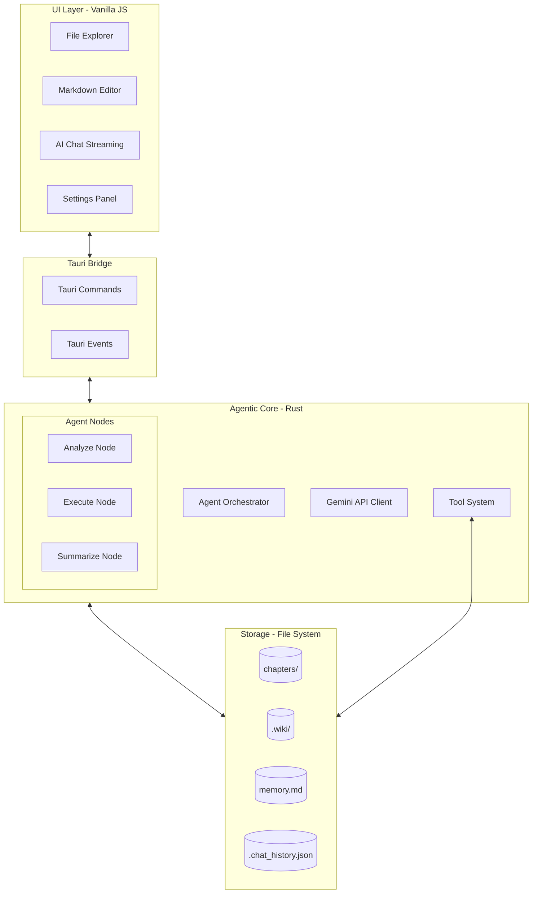

# AI_Write_Novel Architecture 🏗️

Hệ thống **AI_Write_Novel** được thiết kế theo kiến trúc lớp (Layered Architecture) kết hợp với mô hình hướng sự kiện (Event-Driven), giúp tách biệt logic xử lý AI nặng nề ở Backend và phản hồi mượt mà ở Frontend.

## 1. Tổng quan các Lớp

### 1.1 Frontend (UI Layer)
- **Công nghệ**: HTML5, Vanilla JS, CSS3.
- **Thành phần**: 
    - **File Explorer**: Quản lý cây thư mục, hiển thị đặc biệt cho `.wiki/` và trạng thái file.
    - **Settings Panel**: Giao diện cấu hình API Key và chọn mô hình AI linh hoạt.
    - **Interactive Footer**: Thanh công cụ điều khiển chat, tích hợp chế độ gửi tin (Enter vs Shift+Enter).
- **Phản ứng sự kiện**: 
    - Lắng nghe `file-system-changed` để làm mới cây thư mục.
    - Lắng nghe `open-file` để tự động chuyển tab Editor sang file mới được tạo/sửa.
    - Stream dữ liệu từ `ai-chat-stream` để hiển thị nội dung, Thought blocks và Tool call status.

### 1.2 Bridge (Tauri Layer)
- **Commands**: `ai_chat`, `get_settings`, `save_settings`, `get_chat_history`, `list_models`.
- **Global Events**: Sử dụng `app_handle.emit()` để đồng bộ trạng thái từ Rust sang JS (ví dụ: thông báo mở file, stream kết quả AI).

### 1.3 Agentic Backend (Rust Layer)
Hệ thống sử dụng **Agent Loop** với cơ chế State Machine:
- **Analyze Node**: Sử dụng System Prompt để lập kế hoạch thực thi dựa trên context từ `memory.md` và `wiki/`.
- **Execute Node**: Thực thi tuần tự các Tools (Function Calling). Tự động đẩy sự kiện `open-file` về UI.
- **Summarize Node**: 
    - Tóm tắt kết quả các bước đã thực hiện.
    - **Tự động cập nhật `memory.md`** để duy trì trạng thái dài hạn.
    - Gửi phản hồi cuối cùng cho người dùng và lưu vào `.chat_history.json`.

---

## 2. Hệ thống Wiki & Memory

### 2.1 Wiki Graph
- **Vị trí**: Thư mục ẩn `.wiki/`.
- **Đồng bộ**: Khi Agent thực thi tool `wiki_upsert_entity`, file markdown tương ứng sẽ được cập nhật kèm Frontmatter. UI File Explorer ưu tiên hiển thị thư mục này để người dùng dễ theo dõi kiến thức truyện.

### 2.2 Chat History & Memory
- **`memory.md`**: Bộ nhớ "ý thức" của truyện, chứa tóm tắt cốt truyện và các thực thể quan trọng.
- **`.chat_history.json`**: Bộ nhớ "phiên làm việc", lưu trữ log chat để Agent có thể hiểu ngữ cảnh hội thoại hiện tại.

---

## 3. Luồng xử lý Tổng quát

1. **User Action**: Người dùng gửi yêu cầu hoặc thay đổi cấu hình trong Settings.
2. **Context Assembly**: Agent tải `memory.md`, `.chat_history.json` và các thực thể Wiki liên quan.
3. **Execution Loop**:
    - `Analyze`: Phân tích và quyết định các "Action" cần làm.
    - `Execute`: Gọi Tools (ví dụ: `write_file`). Backend phát sự kiện `open-file` ngay lập tức.
4. **Finalization**:
    - `Summarize`: Agent tổng hợp thành tựu, cập nhật bộ nhớ dài hạn (`memory.md`).
    - **User Notification**: Thông báo hoàn tất và sẵn sàmg cho yêu cầu tiếp theo.

---

## 4. Quy tắc Mở rộng

- **Thêm Tool**: Định nghĩa trong `ai/tools.rs` -> Khai báo JSON cho Gemini -> Bổ sung logic xử lý trong `execute_tool_calls`.
- **Đổi Mô hình**: Cấu hình mô hình mới trong Settings; Backend sử dụng `get_model()` để điều chỉnh API call tương ứng.
