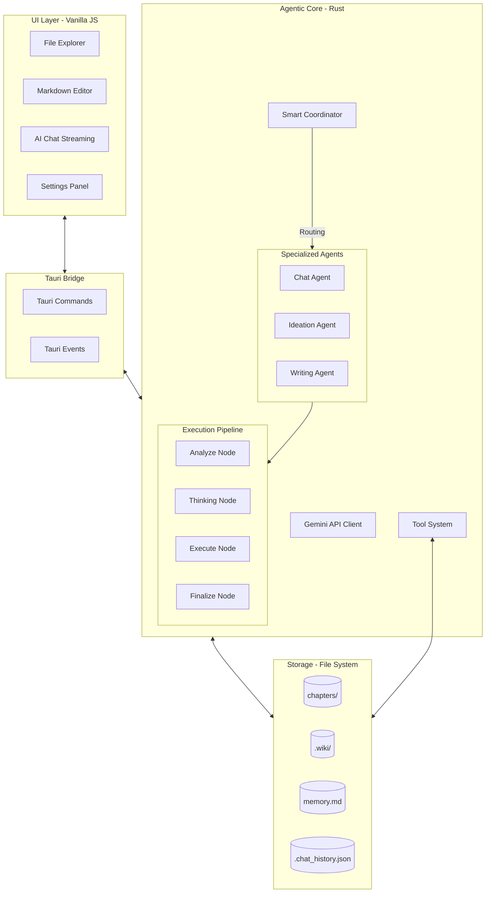

# AI_Write_Novel Architecture 🏗️

Hệ thống **AI_Write_Novel** được thiết kế theo kiến trúc lớp (Layered Architecture) kết hợp với mô hình hướng sự kiện (Event-Driven). Trái tim của hệ thống là một **Multi-Agent Orchestrator** giúp điều phối các tác vụ phức tạp qua quy trình xử lý đa bước (Multi-step Pipeline).

## 1. Tổng quan các Lớp

### 1.1 Frontend (UI Layer)
- **Thành phần**: 
    - **File Explorer**: Quản lý cây thư mục, tích hợp sâu với `.wiki/`.
    - **Markdown Editor**: Trình soạn thảo chính.
    - **AI Chat**: Hỗ trợ hiển thị "Thought Blocks" phân loại theo từng bước xử lý.
- **Phản ứng sự kiện**: 
    - Lắng nghe `ai-chat-stream-thought` để hiển thị tiến trình (Analyze, Thinking, Execute,...).
    - Lắng nghe `ai-agent-selected` để xác định Agent đang hoạt động.

### 1.2 Bridge (Tauri Layer)
- **Commands**: `ai_chat`, `stop_ai_chat`, `get_settings`, `open_file`, v.v.
- **Global Events**: Stream dữ liệu real-time qua Webview Window.

### 1.3 Agentic Backend (Rust Layer)
Hệ thống sử dụng cơ chế **Multi-Agent Coordination** với Pipeline 4 bước chuyên sâu:
- **Smart Coordinator**: Phân tích ý định người dùng để chọn Agent hoặc phản hồi trực tiếp.
- **Execution Pipeline**:
    - **Analyze (Tool-Enabled)**: Phân tích bối cảnh dự án, nạp kiến thức từ Wiki/Memory. Có quyền sử dụng công cụ nghiên cứu (Search, Read File).
    - **Thinking (Creative - No Tools)**: Tập trung tư duy sáng tạo hoặc lập kế hoạch chi tiết. Agent hoạt động ở trạng thái "thuần tư duy", trả về kết quả dưới dạng JSON để đảm bảo độ chính xác.
    - **Execute (System - Tool-Enabled)**: Thực thi các tác vụ hệ thống như lưu file, cập nhật Wiki Graph.
    - **Finalize (Management - No Tools)**: Tổng kết tiến độ và tự động cập nhật `memory.md` để duy trì bộ nhớ dài hạn.

---

## 2. Hệ thống Wiki & Memory

### 2.1 Wiki Graph
- **Vị trí**: Thư mục `.wiki/`.
- **Cơ chế**: Dữ liệu thực thể được lưu trữ dạng Markdown kèm Frontmatter Metadata. Agent chủ động cập nhật qua bước `Execute`.

### 2.2 Memory & Context Optimization
- **`memory.md`**: Lưu trữ bản tóm tắt trạng thái cốt truyện hiện tại.
- **Context Pruning**: Hệ thống tự động dọn dẹp (Prune) các nội dung Tool Response cũ hoặc quá dài trước bước `Finalize` để tiết kiệm Token mà không mất ngữ cảnh quan trọng.

---

## 3. Luồng xử lý Tổng quát

1.  **Intent Classification**: `Coordinator` chọn Agent (Writing/Ideation/Chat).
2.  **Analyze**: AI nghiên cứu mã nguồn, thư mục và Wiki.
3.  **Thinking**: AI sáng tác nội dung hoặc lên ý tưởng (Kết quả trả về JSON).
4.  **Execute**: Hệ thống thực thi các lệnh từ JSON (Lưu chapter, cập nhật Wiki).
5.  **Finalize**: Cập nhật `memory.md` và gửi câu trả lời hoàn chỉnh.

---

## 4. JSON Pipeline & Automation 🤖

Hệ thống áp dụng **JSON-Strict Flow** tại các bước then chốt:
- Agent tại bước `Thinking` được yêu cầu trả về XML/JSON block.
- Backend Rust sử dụng `extract_json_block` để trích xuất dữ liệu.
- **Tự động hóa**: Nếu Agent đề xuất `chapter_content`, hệ thống sẽ tự động gọi `write_file` mà không cần Agent phải tự gọi tool một cách thủ công trong vòng lặp tư duy, giúp tăng độ ổn định.

---

## 5. Cơ chế Thought Streaming
Mọi bước tư duy trung gian đều được stream về Frontend qua sự kiện `ai-chat-stream-thought`, cho phép người dùng quan sát quá trình Agent:
- Đang phân tích dữ liệu gì.
- Đang phác thảo ý tưởng nào.
- Đang cập nhật thực thể Wiki nào.

---

## 6. Quy tắc Mở rộng

- **Thêm Tool**: Định nghĩa trong `ai/tools.rs` và đăng ký trong `execute_tool_calls` tại `ai/nodes/mod.rs`.
- **Thêm Node**: Tạo file mới trong `ai/nodes/`, sử dụng `run_agent_loop` với cấu hình `allow_tools` phù hợp.

